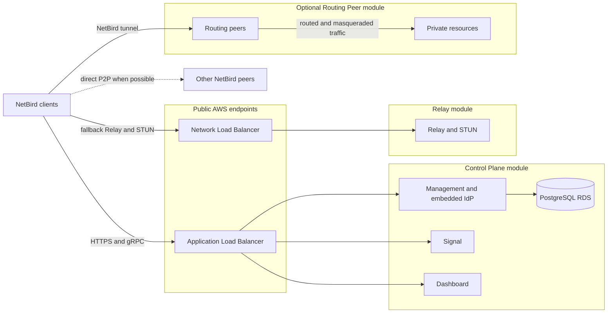

# Terraform modules for self-hosted NetBird on AWS

This repository provides opinionated Terraform modules for running self-hosted NetBird on existing AWS infrastructure. The modules isolate control-plane components, use managed AWS compute and data services, define explicit trust boundaries, and support routed access to private networks without making foundational networking part of the module contract.

The repository is a cohesive reference architecture composed of independently deployable modules. The Control Plane and at least one Relay site form the baseline platform. Routing Peer sites are optional and can be added wherever NetBird clients need access to existing private resources.

## TL;DR

- Deploys self-hosted NetBird on AWS using Terraform.
- Runs Management, Signal, and Dashboard as separate ECS Fargate services with PostgreSQL RDS.
- Runs each Relay/STUN site independently on Fargate behind an NLB.
- Optionally deploys private-network routing peers on ECS Managed Instances.
- Expects existing VPCs, subnets, DNS, certificates, and a Terraform backend.
- Favors managed AWS services, pinned images, explicit trust boundaries, and independent replacement over the smallest possible topology.

Start with the [module overview](#modules), [deployment order](#deployment-order), and [examples](./examples). Read [Architecture](./docs/ARCHITECTURE.md) for the rationale and trade-offs.

## Why this architecture

NetBird's compact self-hosting topology is convenient for small installations, but sharing a runtime couples component scaling, replacement, and failure. This repository separates Management, Signal, Dashboard, Relay, and routing responsibilities so that each can use the AWS service and lifecycle appropriate to it.

The design is useful for organizations that:

- already own their AWS accounts, VPCs, subnets, DNS zones, and certificates;
- want PostgreSQL-backed Management rather than node-local state;
- prefer managed compute over administratively managed general-purpose hosts;
- need external identity-provider integration and explicit proxy trust;
- want to migrate gradually from a traditional routed VPN; or
- want Relay and routing sites to remain independent failure domains.

See [Architecture](./docs/ARCHITECTURE.md) for the decisions, trust boundaries, traffic paths, and deliberate trade-offs.

## Architecture at a glance

## Modules

| Module | Role | Runtime | Adoption |
| --- | --- | --- | --- |
| [`modules/control-plane`](./modules/control-plane) | Management, Signal, Dashboard, embedded identity broker, and PostgreSQL | Three ECS Fargate services behind an ALB; provisioned RDS | Core |
| [`modules/relay`](./modules/relay) | One independently addressable Relay and STUN site | ECS Fargate behind an NLB | Baseline; deploy one or more sites |
| [`modules/routing-peer`](./modules/routing-peer) | One routing site for existing private resources | NetBird tasks on ECS Managed Instances | Optional |

Each module creates its own ECS cluster and invokes no other module. A calling Terraform or Terragrunt configuration supplies shared infrastructure identifiers and connects module outputs to module inputs.

## Design principles

- **Separate lifecycles:** Management, Signal, Dashboard, Relay sites, and routing sites can be replaced independently.
- **Managed infrastructure:** Fargate, ECS Managed Instances, RDS, Secrets Manager, KMS, Route 53, and AWS load balancers carry most infrastructure operations.
- **Explicit ownership:** Modules create application resources but do not create AWS accounts, VPCs, subnets, hosted zones, certificates, or Terraform backends.
- **Secrets stay out of configuration:** Runtime secret values are delivered through Secrets Manager rather than module inputs.
- **Conservative scaling:** Stateful or insufficiently verified components remain singletons; callers choose capacity where safe.
- **Pinned software:** Container images must use versioned references. Immutable digests are recommended after validation.
- **Incremental adoption:** Routing peers can provide broad private-network access first; direct workload peers can be introduced later.

## What callers must provide

Depending on the selected modules, the calling environment provides:

- an AWS provider configuration and Terraform backend;
- existing VPC and subnet IDs;
- an existing public Route 53 hosted zone and regional ACM certificate or certificates;
- network egress or the VPC endpoints needed by private tasks;
- a Relay authentication secret in Secrets Manager;
- a routing-peer setup key in Secrets Manager when routing sites are used; and
- NetBird-side identity, group, policy, Network, and resource configuration.

The modules do not discover environment resources by tags and do not configure AWS providers inside child modules.

Terraform 1.11 or newer and AWS provider 6.64 or newer are required. The modules constrain supported provider major versions; the consuming environment should select and lock exact provider versions.

## Deployment order

1. Prepare the caller-owned AWS network, DNS, certificate, and secret prerequisites.
2. Deploy at least one [Relay site](./modules/relay).
3. Deploy the [Control Plane](./modules/control-plane), passing the Relay secret ARN and advertised Relay/STUN addresses.
4. Complete bootstrap, configure an external identity provider, and enroll test clients.
5. Optionally prepare a routing-peer group and setup key, then deploy one or more [Routing Peer sites](./modules/routing-peer).
6. Configure NetBird Networks, resources, groups, and access policies.

The detailed sequence, decisions, and readiness checks are in [Deployment](./docs/DEPLOYMENT.md).

## Evolution toward workload-local connectivity

Routing peers provide a practical migration path for reaching existing private networks without installing NetBird on every workload. Deployments can later move connectivity closer to workloads through direct server peers, narrower routing sites, or Kubernetes integration such as the NetBird Kubernetes operator.

Workload-local connectivity can reduce shared routing scope and improve policy precision and attribution. It is a separate deployment concern and is not implemented by these modules.

## Apply and readiness behavior

Terraform creates or updates ECS services but does not wait for their deployments to reach steady state. A successful apply means that AWS accepted the desired configuration; it does not prove that tasks are healthy.

After each deployment, verify ECS service events, running task counts, target-group health where applicable, CloudWatch logs, and application-level connectivity. The Routing Peer module includes a documented creation-time workaround for the ECS Managed Instances capacity-provider activation delay.

## Optional IPv6

The Control Plane and Routing Peer modules expose optional IPv6 support:

- The Control Plane can publish dual-stack ALB endpoints while keeping IPv4 application targets.
- Routing-peer task ENIs can use IPv6 as a direct NetBird transport underlay while continuing to route IPv4 resources.
- The Relay module remains IPv4-only; native Relay IPv6 and Relay QUIC require a different frontend design and are intentionally deferred.

See [IPv6 support](./IPV6.md) for infrastructure requirements, behavior, limitations, and verification.

## Documentation

- [Architecture](./docs/ARCHITECTURE.md): motivation, component boundaries, traffic flows, trust model, availability, and trade-offs.
- [Deployment](./docs/DEPLOYMENT.md): prerequisites, deployment sequence, decisions, verification, and lifecycle guidance.
- [Examples](./examples): canonical module configurations and composition guidance.
- [IPv6 support](./IPV6.md): optional dual-stack scope and AWS requirements.
- [Traffic-event auditability](./TRAFFIC-EVENTS.md): deferred investigation and possible future approaches.
- [Control Plane module](./modules/control-plane): module contract and operations.
- [Relay module](./modules/relay): module contract and operations.
- [Routing Peer module](./modules/routing-peer): module contract and NetBird-side routing setup.
- [Okta integration](./modules/control-plane/OKTA.md): one example of configuring an external identity provider.

## Maintenance and releases

`main` is the releasable integration branch. Changes use short-lived branches and pull requests, and CI checks Terraform formatting and validates every module. All modules share immutable semantic-version tags so consuming environments can pin one reviewed repository state.

- [Contributing](./CONTRIBUTING.md): branch model, compatibility expectations, pull requests, and validation.
- [Releasing](./RELEASING.md): internal release candidates, stable releases, version selection, and recovery.
- [Changelog](./CHANGELOG.md): user-visible changes accumulated for the next release.

## License

Licensed under the [Apache License 2.0](./LICENSE).
